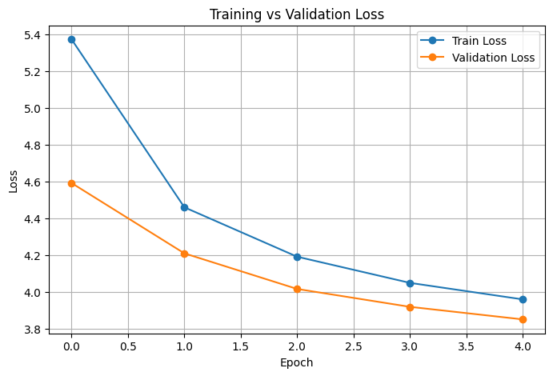

# Small KinyaGPT — A 51M-Parameter GPT Language Model for Kinyarwanda

**KinyaGPT** is a **51 million parameter**, lightweight, decoder-only Transformer (GPT-style) language model trained from scratch on the [mbazaNLP Kinyarwanda Monolingual Dataset](https://huggingface.co/datasets/mbazaNLP/kinyarwanda_monolingual_v01.1).
It demonstrates how to build a custom language model from the ground up including tokenizer creation, data preprocessing, model training, and text generation for a **low-resource language**.

---

## Highlights

* ~51M parameters built entirely from scratch
* Focused on Kinyarwanda, a low-resource Bantu language
* Full end-to-end pipeline: tokenizer → preprocessing → training → generation
* Metrics and training curves included
* Interactive Jupyter notebook with the full training process

---

## Model Overview

| Feature             | Value                                  |
| ------------------- | -------------------------------------- |
| **Architecture**    | Decoder-only Transformer (GPT-style)   |
| **Parameters**      | ~51 million                            |
| **Embedding Size**  | 512                                    |
| **Layers**          | 6                                      |
| **Attention Heads** | 8                                      |
| **Context Window**  | 512 tokens                             |
| **Vocabulary Size** | 32,000                                 |
| **Dataset**         | mbazaNLP Kinyarwanda Monolingual v01.1 |

---

## Training Performance

| Metric              | Value |
| ------------------- | ----- |
| **Training Loss**   | ~3.95 |
| **Validation Loss** | ~3.83 |
| **Perplexity**      | ~42.0 |
| **Accuray**         | ~33.44%|

### Training vs. Validation Loss



---

## How to Use

### 1. Install Dependencies

```bash
pip install -r requirements.txt
```

### 2. Train the Tokenizer

```bash
python src/tokenizer.py --dataset mbazaNLP/kinyarwanda_monolingual_v01.1 --vocab_size 32000 --save_path data/kinyarwanda_bpe.json
```

### 3. Preprocess the Dataset

```bash
python src/utils.py
```

### 4. Train the Model

```bash
python src/train.py --epochs 8 --batch_size 32 --block_size 512
```

### 5. Generate Text

```bash
python src/generate.py --prompt "Paul Kagame" --max_new_tokens 100
```

---

## Example Output

```text
Prompt: Paul Kagame
Output: Paul Kagame ni umwe mu bayobozi bafite amateka akomeye mu Rwanda, aho yayoboye inzira y'iterambere ry'igihugu mu myaka ishize...
```

---

## Project Structure

```
Small KinyaGPT/
├─ src/
│   ├─ generate.py       # Text generation
│   ├─ model.py          # GPT model definition
│   ├─ tokenizer.py      # Tokenizer training
│   ├─ train.py          # Training script
│   └─ utils.py          # Data loading/preprocessing
├─ data/                # Tokenizer & tokenized data
├─ notebook/           # Interactive training notebook
├─ assets/             # Graphs & plots
├─ requirements.txt
└─ README.md
```

---

## Dataset

* **Source:** [mbazaNLP Kinyarwanda Monolingual v01.1](https://huggingface.co/datasets/mbazaNLP/kinyarwanda_monolingual_v01.1)
* ~93M tokens of Kinyarwanda text collected from public sources

---

## Future Work

* Train a larger and more capable model
* Evaluate performance on downstream tasks and benchmarks
* Explore LoRA/QLoRA for efficient fine-tuning
* Develop an API for text generation

---

## License

This project is released under the [MIT License](./LICENSE).

---

## Author

**Schadrack Karekezi**

This project demonstrates how to build a GPT-style model from scratch for a low-resource language — bridging the gap between academic research and real-world NLP applications.

---
